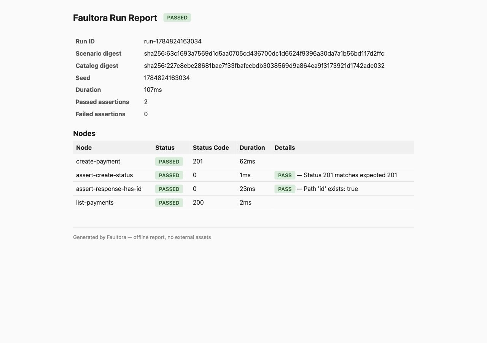

# Faultora

**Break it here. Trust it everywhere.**

Faultora is a self-hosted reliability testing CLI for HTTP APIs and event-driven
systems. It imports OpenAPI and AsyncAPI descriptions, runs repeatable scenarios
across HTTP and Kafka, checks technical and business invariants, and produces
console, JSON, HTML, and JUnit reports. Execution stays inside your
infrastructure and does not require a hosted control plane or telemetry.

Version 0.7.0 is a runnable technical preview. It targets local
development and CI use on Java 21.

## What 0.7.0 includes

Scenario execution:

- OpenAPI 3.x and AsyncAPI 3.0 import, together in one run;
- versioned YAML scenarios with runtime inputs (`--input key=value`);
- HTTP GET, POST, PUT, PATCH, DELETE, HEAD, and OPTIONS operations;
- step output binding: later steps reference earlier responses through
  `{{steps.<name>.body...}}` templates;
- bounded parallel groups for genuinely concurrent requests;
- repeat groups: a fixed count or a literal item list, with `{{repeat.index}}`
  and `{{repeat.item}}` bound per iteration;
- eventually (poll-until) groups that converge on asynchronous state and fail
  with a spent budget instead of hanging;
- request values generated from the operation's schema, deterministically from
  the run seed, with explicit inputs applied over them;
- retry policies with exponential backoff and deterministic seed-derived
  jitter;
- sequential operation and wait steps with explicit dependencies;
- per-step, per-group, and scenario-wide deadlines, bounded by the
  execution policy's wall-clock budget;
- Kafka operations: publish a command, observe the events it caused, within a
  window bounded below by the run's own start and above by a wait the execution
  policy caps;
- status, header, response-schema, JSONPath, and duration assertions;
- event assertions: count, uniqueness, correlation continuity, and ordered or
  unordered sequences;
- console, JSON, HTML, and JUnit reports.

Fault injection:

- in-process faults with no external dependencies: `http-latency`,
  `http-error`, and `http-response-loss`, with a hard-expiry watchdog and
  guaranteed exactly-once rollback;
- real network faults through a [Toxiproxy](https://github.com/Shopify/toxiproxy)
  instance (`--toxiproxy-url`): `network-latency`, `network-timeout`,
  `network-reset`, and `network-bandwidth`;
- `expectError` steps for requests that are supposed to fail under a fault;
- fault windows and fault-to-node attribution in console and HTML reports.

Security posture:

- SSRF protection with DNS resolution and address pinning;
- bounded HTTP response streaming;
- policy-bounded in-memory evidence for assertions;
- header filtering, content-type allowlists, body limits, and JSON redaction;
- manual redirect handling with cross-origin credential stripping;
- environment-backed bearer-token resolution.

The in-process fault provider acts only on Faultora's own outbound requests.
It never touches the target system, its infrastructure, or other traffic, so
no extra privileges are needed. Network faults require a Toxiproxy you already
operate on the traffic path.

Kafka, distributed workers, Kubernetes orchestration, and the web interface
are not part of this release. Scenarios that request unsupported execution
features are rejected during validation or plan compilation rather than being
silently accepted.

## Requirements

- Java 21 or newer;
- Maven is not required when using the release JAR.

## Install

Download the release JAR and its checksums:

```bash
FAULTORA_VERSION=0.7.0
RELEASE_URL="https://github.com/Malatiel/Faultora/releases/download/v${FAULTORA_VERSION}"

curl --fail --location --retry 3 \
  --output "faultora-${FAULTORA_VERSION}.jar" \
  "${RELEASE_URL}/faultora-${FAULTORA_VERSION}.jar"
curl --fail --location --retry 3 \
  --output SHA256SUMS \
  "${RELEASE_URL}/SHA256SUMS"

grep " faultora-${FAULTORA_VERSION}.jar$" SHA256SUMS \
  | sha256sum --check --strict -

java -jar "faultora-${FAULTORA_VERSION}.jar" --version
```

On macOS, use `shasum -a 256 -c` instead of `sha256sum --check --strict`.
Every release also includes a CycloneDX SBOM and the Apache 2.0 license.

## Build

```bash
./mvnw verify -B
```

The executable artifact is written to:

```text
faultora-cli/target/faultora-0.7.0.jar
```

The regular CI build can run without repository secrets. Configure the
`NVD_API_KEY` repository secret to enable OWASP Dependency Check on every push.
Release publication always requires this secret and fails closed when it is
missing.

## Quick start

Check the executable and validate the example scenario:

```bash
java -jar faultora-cli/target/faultora-0.7.0.jar --version

java -jar faultora-cli/target/faultora-0.7.0.jar \
  validate \
  --scenario examples/payment-service/scenarios/passing.yaml
```

Generate a starter scenario from an OpenAPI document:

```bash
java -jar faultora-cli/target/faultora-0.7.0.jar \
  init \
  --from-openapi examples/payment-service/openapi.yaml \
  --output ./generated
```

Run a scenario against an API:

```bash
java -jar faultora-cli/target/faultora-0.7.0.jar \
  test \
  --scenario examples/payment-service/scenarios/passing.yaml \
  --openapi examples/payment-service/openapi.yaml \
  --target https://api.example.com \
  --format console,json,junit,html \
  --output faultora-results
```

Private, loopback, and link-local destinations are blocked by default. Use
`--allow-private` only for an explicitly trusted local test environment.
Operations the description classifies as destructive are withheld in the same
way: a cleanup that deletes what its setup created is ordinary and supported,
but it takes `--allow-destructive` to permit it.

### Targets

Target identity — name, protocols, authentication schemes — comes from the
imported description. `--target` decides where that target actually lives for
this run:

```bash
# every catalog target answers at one URL
--target https://staging.example.com

# one catalog target is bound separately, the rest follow the plain --target
--target https://staging.example.com --target ledger=http://localhost:7777
```

An operation whose target is neither declared in the catalog nor bound to a
URL fails with `TARGET_NOT_FOUND` instead of being sent somewhere arbitrary.

The base URL inside an OpenAPI document is never contacted on its own: without
`--target`, every target is bound to `http://localhost:8080`. A description
committed to a repository cannot direct a run at the environment it
documents.

## Fault injection

The flagship reliability scenario races two concurrent `create-payment`
requests that share one `Idempotency-Key` while injected latency widens the
race window, then asserts the business invariant that exactly one payment
exists:

```bash
java -jar faultora-cli/target/faultora-0.7.0.jar \
  test \
  --scenario examples/payment-service/scenarios/fault-concurrent-duplicate.yaml \
  --openapi examples/payment-service/openapi.yaml \
  --target http://localhost:8080 \
  --allow-private
```

```text
--- Nodes ---
  [PASSED] sync-delay (0ms)
  [PASSED] first-client (164ms)
  [PASSED] second-client (166ms)
  [PASSED] race (167ms)
  [PASSED] list-payments (164ms)
  [PASSED] first-client-got-a-payment (0ms)
         Assertion: PASS — Path 'id' exists: true
  [PASSED] second-client-got-a-payment (0ms)
         Assertion: PASS — Path 'id' exists: true
  [PASSED] exactly-one-payment (0ms)
         Assertion: PASS — Path '@' has 1 elements

--- Faults ---
  [http-latency] target * — active 10003ms, rollback: run-end
         During fault: first-client, second-client, list-payments
```

The same scenario detects the classic check-then-act idempotency bug: the
end-to-end suite runs it against a deliberately broken variant of the example
API and requires the invariant assertion to fail.

Further reference scenarios cover a lost response followed by an
idempotency-key retry (`fault-duplicate-payment.yaml`), retrying through a
brief outage (`fault-retry.yaml`), and SLA verification under injected
latency (`fault-latency.yaml`). See the
[scenario reference](docs/SCENARIO_REFERENCE.md#faults) for fault types,
parameters, and rollback guarantees.

## Eventual consistency and batches

An `eventually` block polls one operation until every condition holds, so a
scenario can verify asynchronous state without sleeping for a guessed
duration:

```yaml
- id: settlement-visible
  type: eventually
  timeout: 10s
  interval: 200ms
  dependsOn: [create-payment]
  steps:
    - id: poll-payment
      type: operation
      operationId: get-payment
      inputs:
        paymentId: "{{steps.created.body.id}}"
  until:
    - assertionType: jsonpath
      params:
        path: status
        equals: settled
```

```text
--- Nodes ---
  [PASSED] create-payment (47ms)
  [PASSED] poll-payment (444ms)
  [PASSED] settlement-visible (444ms) — 3 polls
         Assertion: PASS — Status 200 matches expected 200
         Assertion: PASS — Path 'status' equals 'settled'
```

When the conditions never hold, the block fails with the budget it spent and
the last observed value rather than hanging:

```text
  [FAILED] never-refunded (611ms) — 7 polls
         Error: Conditions were not satisfied within 600ms after 7 polls:
                Path 'status' expected 'refunded' but got 'settled'
```

A `repeat` block runs its children once per iteration, over a fixed count or a
literal item list:

```yaml
- id: create-batch
  type: repeat
  forEach: [EUR, USD, GBP]
  steps:
    - id: create-payment
      type: operation
      operationId: create-payment
      inputs:
        body:
          currency: "{{repeat.item}}"
```

Both blocks are budgeted before execution: the poll count and the iteration
count are known at compile time and count against the run's request budget.
Reference scenarios live in
[`examples/payment-service/scenarios`](examples/payment-service/scenarios)
as `eventually-settlement.yaml` and `repeat-batch.yaml`.

## Events

An AsyncAPI 3.0 description brings Kafka channels into the same catalog as the
HTTP operations, and `--openapi` and `--asyncapi` can be given together:

```bash
java -jar faultora-cli/target/faultora-0.7.0.jar \
  test \
  --scenario examples/payment-worker/scenarios/duplicate-delivery.yaml \
  --asyncapi examples/payment-worker/asyncapi.yaml \
  --target broker=kafka://localhost:9092 \
  --allow-private
```

An event operation is an ordinary `operation` step; there is no separate step
type, so retries, deadlines, `eventually`, and generated payloads all work on
it unchanged. AsyncAPI states each operation's direction from the *application's*
point of view, and the importer inverts it: a channel the application receives
on is one your scenario publishes to.

```yaml
- id: send-command
  type: operation
  operationId: settlePayment
  inputs:
    key: "pay-{{run.seed}}"
    headers:
      correlation-id: "pay-{{run.seed}}"
    body:
      paymentId: "pay-{{run.seed}}"
      amount: 2500

- id: read-settlements
  type: operation
  operationId: paymentSettled
  inputs:
    match:
      payload:
        paymentId: "pay-{{run.seed}}"
    waitMs: 2000
```

An observation never reports history from before the run started, and which
messages a step is *about* is decided by its `match` clause rather than by
position — so two runs, or two iterations of a repeat block, each see their own
messages. Faultora assigns partitions directly and commits no offsets, so a run
creates no consumer group on your broker and leaves nothing behind.

Published twice on purpose, the reference scenario proves the target settles
once:

```text
--- Nodes ---
  [PASSED] send-command (57ms) — published to payment-commands at 0:0
  [PASSED] send-command-again (23ms) — published to payment-commands at 0:1
  [PASSED] settlement-appears (1065ms) — 1 poll
         Assertion: PASS — Observed 1 message
  [PASSED] read-settlements (2067ms) — observed 1 of 1 on payment-events
  [PASSED] one-effect-per-command (1ms)
         Assertion: PASS — Observed 1 message
  [PASSED] no-payment-settled-twice (4ms)
         Assertion: PASS — 1 message with distinct payload:paymentId
  [PASSED] correlation-survives-the-hop (3ms)
         Assertion: PASS — 1 message carries header:correlation-id 'pay-77001'
```

Against a consumer that is not idempotent, the same scenario says so:

```text
  [FAILED] no-payment-settled-twice (2ms)
         Assertion: FAIL — Two messages carry the same payload:paymentId
                    'pay-77002': offsets 0 and 1
```

The worker both variants run against lives in
[`examples/payment-worker`](examples/payment-worker), with its AsyncAPI
description and the scenario above.

## Generated requests

A step can build its body from the schema the API description declares, and
still pin the fields its assertions depend on:

```yaml
- id: create-payment
  type: operation
  operationId: create-payment
  generate:
    fields: [body]
    strategy: valid       # valid | boundary | invalid
  inputs:
    body:
      currency: EUR       # applied over the generated value
```

Re-running with the same `--seed` sends the identical payload; a retry and a
poll resend it too, so idempotency scenarios keep testing what they claim to.
Properties the description marks `readOnly` are left out — they belong to
responses. Each generated input is journalled with its seed, schema, and a
digest — never the payload, which is request data the evidence policy
governs.

A schema the generator cannot satisfy — a regular expression, an empty range —
fails plan compilation naming the field, rather than sending a request the
contract already rejects. Supported constraints are listed in the
[scenario reference](docs/SCENARIO_REFERENCE.md#generated-request-values).

## Reports

Faultora can write console, JSON, JUnit XML, and self-contained offline HTML
reports in one run:

```text
=== Faultora Run Report ===
--- Nodes ---
  [PASSED] create-payment (48ms)
  [PASSED] create-status (2ms)
         Assertion: PASS — Status 201 matches expected 201
  [PASSED] response-has-id (23ms)
         Assertion: PASS — Path 'id' exists: true
  [PASSED] response-matches-its-contract (1ms)
         Assertion: PASS — Response matches its declared schema
  [PASSED] list-payments (2ms)

Result: PASSED — 5 nodes, 3 passed assertions, 0 failed assertions (98ms)
```



The HTML report has no CDN, remote fonts, scripts, or telemetry and can be
opened directly from a CI artifact.

## CI integration

A copy-ready GitHub Actions workflow is available at
[`examples/github-actions/faultora.yml`](examples/github-actions/faultora.yml).
Copy it to `.github/workflows/faultora.yml` in the project being tested, then:

1. place the scenario at `faultora/scenario.yaml`;
2. place the OpenAPI document at `faultora/openapi.yaml`;
3. create the repository variable `FAULTORA_TARGET_URL`;
4. create the repository secret `FAULTORA_API_TOKEN`.

The example downloads the pinned release and verifies its SHA-256 checksum.
Pull requests validate the scenario without receiving credentials or contacting
the target. Main-branch pushes and manual runs execute all report formats and
upload the results even when an assertion fails. For an unauthenticated API,
remove `--auth-secret-id api` and `FAULTORA_SECRET_API` from the workflow.

## Credentials

Faultora accepts a secret handle rather than a token on the command line. A
handle is mapped to an environment variable with the `FAULTORA_SECRET_` prefix:

```bash
export FAULTORA_SECRET_PAYMENTS_API='replace-with-a-real-token'

java -jar faultora-cli/target/faultora-0.7.0.jar \
  test \
  --scenario scenario.yaml \
  --openapi openapi.yaml \
  --target https://api.example.com \
  --auth-secret-id payments-api
```

For `payments-api`, Faultora reads `FAULTORA_SECRET_PAYMENTS_API`. Secret values
are never written to scenario files or normal diagnostic output. Apache
HttpClient header and wire logging is disabled in the release configuration.

## Exit codes

| Code | Meaning |
|---:|---|
| `0` | All tests passed |
| `1` | A scenario assertion failed |
| `2` | Invalid scenario or CLI configuration |
| `3` | Runner or infrastructure failure |

## Security model

The default policy is intentionally restrictive:

- private and special-purpose network ranges are rejected;
- every redirect hop is checked and pinned independently;
- HTTPS-to-HTTP redirects are rejected;
- credentials are removed on cross-origin redirects;
- HTTP responses are read with a hard byte limit;
- response bodies and headers are held in memory only when required by the
  active evidence policy; the CLI run journal stores evidence digests, not raw
  response bodies;
- authentication and cookie headers are filtered from captured evidence;
- configured redaction fails closed when content cannot be safely processed.

See [Security architecture](docs/SECURITY.md) for the threat model and trust
boundaries. Please report vulnerabilities through GitHub's private security
advisory flow; do not open a public issue with exploit details.

## Project documentation

- [Architecture](docs/ARCHITECTURE.md)
- [Security architecture](docs/SECURITY.md)
- [Scenario reference](docs/SCENARIO_REFERENCE.md)
- [Delivery roadmap](docs/ROADMAP.md)
- [Release plan](docs/RELEASE_PLAN.md)
- [Changelog](CHANGELOG.md)

## License

Copyright 2026 Malatiel. Apache License 2.0 — see [LICENSE](LICENSE) for the
terms and [NOTICE](NOTICE) for the attribution that redistribution must
preserve.

The executable JAR bundles third-party components under the Apache 2.0, MIT,
BSD 3-Clause, and EPL-1.0 licenses; their notices are preserved in
[THIRD-PARTY.txt](THIRD-PARTY.txt), which ships inside the JAR as
`META-INF/THIRD-PARTY.txt`.
