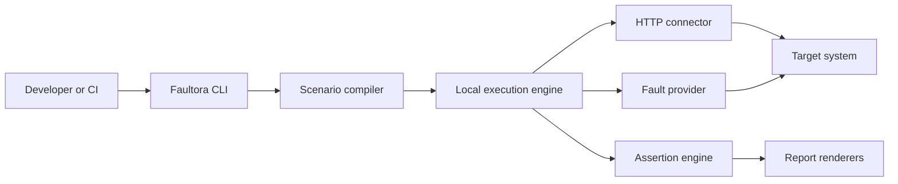
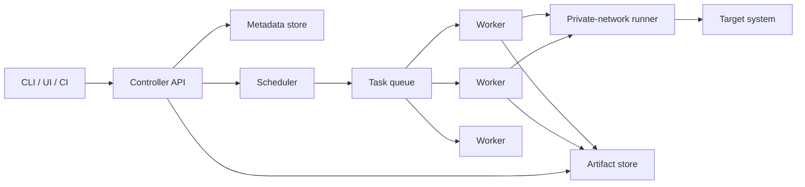
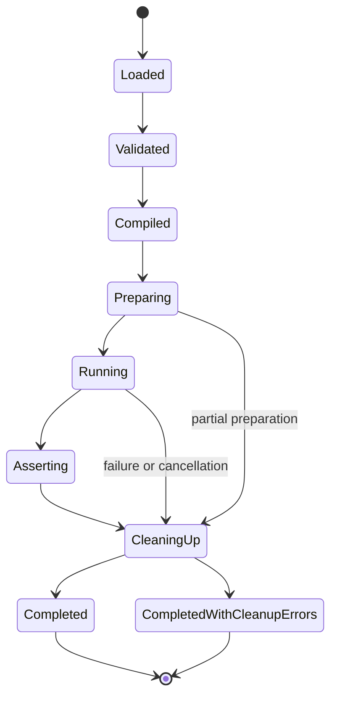

# Faultora architecture

Status: proposed baseline  
Audience: maintainers and implementers

## 1. Purpose

Faultora is a self-hosted reliability testing platform. A user supplies an API
description, environment bindings, and reliability scenarios. Faultora invokes
the target system, injects controlled failures, checks observable invariants,
and produces evidence that can be reviewed by a person or consumed by CI.

The architecture must support a small local runner first and grow into a
distributed execution platform without replacing the scenario language or the
core execution model.

## 2. Product boundary

### 2.1 In scope

- Import HTTP operations and schemas from OpenAPI.
- Import workflows from Arazzo when available.
- Import event-driven contracts from AsyncAPI in a later release.
- Accept manually described operations when no specification exists.
- Execute protocol operations through replaceable connectors.
- Compose sequential, parallel, repeated, and eventually consistent flows.
- Inject faults at protocol, network, broker, and infrastructure boundaries.
- Evaluate contract assertions and user-defined business invariants.
- Run locally, in CI, through a private-network runner, or on distributed
  workers.
- Generate deterministic, inspectable reports and machine-readable results.

### 2.2 Explicit non-goals

- Inferring business correctness from OpenAPI alone.
- Replacing dedicated performance products for maximum-throughput benchmarking.
- Running uncontrolled experiments against production environments.
- Requiring application source-code changes for black-box HTTP testing.
- Building a proprietary network proxy or service mesh in the first releases.
- Providing arbitrary shell or general-purpose script execution inside a
  scenario.

### 2.3 Security acceptance constraint

Faultora must be deployable inside a closed financial-services environment
without transferring API descriptions, target traffic, credentials, evidence,
telemetry, or license checks outside the selected customer boundary. Every
milestone must satisfy the controls assigned to it in the
[security architecture](SECURITY.md); security cannot be deferred to the 1.0
hardening milestone.

## 3. Architectural principles

1. **One scenario, multiple execution modes.** Local and distributed runners
   execute the same compiled plan.
2. **Specifications are inputs, not the engine model.** OpenAPI, AsyncAPI,
   Arazzo, and Protobuf are translated into a canonical catalog.
3. **Business meaning remains explicit.** Users define invariants that cannot
   be derived safely from interface descriptions.
4. **Core is protocol-agnostic.** The engine must not import connector or
   OpenAPI implementation classes.
5. **Side effects are bounded and reversible.** Every injected fault has an
   ownership scope, timeout, and rollback action.
6. **Reproducibility is a feature.** A run records its seed, configuration
   digest, plugin versions, target identity, and ordered evidence.
7. **Safe defaults beat convenience.** Destructive operations, broad network
   access, and high concurrency require explicit policy.
8. **Reports are derived artifacts.** The immutable run event stream is the
   source for console, HTML, JSON, and JUnit output.
9. **Extension isolation.** Third-party extensions execute outside the core
   process once remote plugins are supported.
10. **Local trust ownership.** The customer controls identity, keys, storage,
    network policy, retention, and approved extensions.
11. **No implicit egress.** Network destinations must be derived from an
    approved execution policy; usage analytics and update checks are disabled by
    design.
12. **Minimal evidence.** Request and response bodies are not persisted unless
    an explicit evidence policy enables bounded capture and redaction.

## 4. System contexts

### 4.1 Local and CI mode



Local mode is the reference implementation. It has no controller, external
queue, or persistent server. All state for a run is stored in its artifact
directory. It supports a strict offline profile in which all sources, schemas,
plugins, and dependencies are available locally and network access is limited to
declared targets.

### 4.2 Distributed mode



The controller manages metadata and coordination only. Traffic generation and
fault execution remain in horizontally scalable workers located near the
target. A closed deployment places the controller, queue, workers, runners,
metadata store, artifact store, and identity provider inside the same governed
infrastructure boundary.

## 5. Core domain model

### 5.1 Canonical API catalog

Importers produce a canonical representation independent of the source
specification:

```java
public record ApiCatalog(
        CatalogVersion version,
        List<TargetDefinition> targets,
        List<OperationDefinition> operations,
        Map<SchemaId, DataSchema> schemas,
        Map<AuthSchemeId, AuthSchemeDefinition> authentication,
        List<WorkflowDefinition> workflows
) {}
```

An operation identifies what can be invoked without exposing protocol-specific
runtime types to the engine:

```java
public record OperationDefinition(
        OperationId id,
        ProtocolId protocol,
        TargetId target,
        SafetyClassification safety,
        Map<String, InputDefinition> inputs,
        Optional<SchemaId> requestSchema,
        Map<OutcomeSelector, SchemaId> outcomes,
        Map<String, JsonValue> protocolMetadata
) {}
```

Protocol metadata is validated and interpreted by its connector. The core
model treats it as versioned structured data.

### 5.2 Scenario definition

A scenario has six lifecycle sections:

```yaml
apiVersion: faultora.dev/v1alpha1
kind: Scenario

metadata:
  name: duplicate-payment

inputs: {}
setup: []
execute: []
faults: []
assertions: []
cleanup: []
```

The authoring model is declarative. Parsing produces a typed `ScenarioModel`;
compilation resolves catalogs, variables, capabilities, policies, and
dependencies into an immutable `ExecutionPlan`.

### 5.3 Execution plan

The compiled plan is a directed acyclic graph of typed nodes:

- `OperationNode`
- `ParallelNode`
- `RepeatNode`
- `EventuallyNode`
- `WaitNode`
- `FaultStartNode`
- `FaultStopNode`
- `ObservationNode`
- `AssertionNode`
- `CleanupNode`

Every node declares a stable node ID, its dependencies, and a safety
classification. The rest belongs to the node kinds that can honour it:

- required capabilities, input expressions, and output bindings — nodes that
  invoke an operation;
- deadline and retry policy — operation and group nodes; an assertion, fault,
  or wait node carries neither;
- idempotency behavior and cleanup ownership — nodes with side effects.

Compilation fails before execution when an operation, variable, plugin
capability, or policy cannot be resolved.

## 6. Execution lifecycle



Cleanup is a lifecycle state, not a best-effort callback at process shutdown.
Every acquired resource and active fault registers a cleanup obligation in the
run journal. Obligations use reverse acquisition order and continue after
individual cleanup failures.

### 6.1 Determinism

A run manifest records:

- run ID and timestamps;
- random seed;
- scenario and catalog digests;
- resolved non-secret configuration;
- extension names, versions, and capability versions;
- worker and target identities;
- task attempt numbers;
- final outcome and cleanup outcome.

Random request generation, fault timing jitter, and sharding derive from the
run seed. Replaying a run uses the recorded manifest while allowing environment
bindings to be replaced explicitly.

### 6.2 Cancellation

Cancellation stops admission of new executable nodes, requests cooperative
termination of running nodes, and moves immediately to cleanup. Workers use
leases so abandoned distributed tasks become recoverable after a bounded
period.

## 7. Extension contracts

The first implementation may discover in-process extensions through Java's
service provider mechanism. The contract must nevertheless be designed for a
future out-of-process protocol.

### 7.1 Source importer

```java
public interface SourceImporter {
    Set<SourceType> supportedTypes();

    ImportResult importSource(SourceDocument source, ImportContext context);
}
```

Initial implementation: OpenAPI. Later implementations: Arazzo, AsyncAPI,
Protobuf, Postman collections, and a manual operation format.

### 7.2 Connector

```java
public interface Connector {
    ProtocolId protocol();

    CapabilitySet capabilities();

    PreparedTarget prepare(TargetDefinition target, ConnectorContext context);

    OperationResult execute(
            PreparedTarget target,
            CompiledOperation operation,
            ExecutionContext context
    );

    void close(PreparedTarget target);
}
```

Initial implementation: HTTP. Later implementations: gRPC, Kafka, AMQP,
WebSocket, GraphQL, and JDBC observation.

### 7.3 Fault provider

```java
public interface FaultProvider {
    Set<FaultCapability> capabilities();

    ActiveFault inject(CompiledFault fault, FaultContext context);

    void rollback(ActiveFault fault, FaultContext context);
}
```

Every `ActiveFault` contains a unique handle, target scope, activation time,
hard expiry, and rollback description.

### 7.4 Assertion provider

```java
public interface AssertionProvider {
    AssertionType type();

    AssertionResult evaluate(
            CompiledAssertion assertion,
            EvidenceView evidence,
            AssertionContext context
    );
}
```

Initial assertions cover status, headers, JSON Schema, JSONPath, duration, and
eventual polling. Later assertions cover events, SQL observations, metrics,
traces, and user-hosted assertion services.

### 7.5 Secret resolver

Secret resolvers return opaque values with automatic redaction metadata. The
core logger and report model must never treat secret values as ordinary
strings. Initial resolution uses environment variables and mounted files;
later providers may integrate with Kubernetes and external secret stores.

### 7.6 Report renderer

Renderers consume the normalized run result and evidence index:

- console summary;
- JSON result;
- JUnit XML;
- self-contained HTML report.

No renderer may alter the execution outcome.

## 8. Fault model

Faults are classified by the layer at which they operate:

| Layer | Examples | Initial mechanism |
|---|---|---|
| Protocol | HTTP status, malformed response, delayed webhook | HTTP test double or protocol plugin |
| Network | latency, timeout, reset, bandwidth limit | Toxiproxy integration |
| Broker | duplicate, delay, reorder, consumer interruption | connector-specific test facilities |
| Process | restart, termination | container or runner capability |
| Infrastructure | pod deletion, resource pressure | Kubernetes extension |

Faultora does not promise that every fault is available in every execution
mode. Capability negotiation occurs during plan compilation.

## 9. Safety model

### 9.1 Operation classification

Imported operations receive one of:

- `READ_ONLY`
- `MUTATING`
- `DESTRUCTIVE`
- `UNKNOWN`

Import heuristics may propose a classification, but `DESTRUCTIVE` and
`UNKNOWN` operations require explicit scenario policy before execution.

### 9.2 Execution policy

Policy constrains:

- permitted hosts and network ranges;
- permitted operation classes;
- maximum requests, concurrency, duration, and data volume;
- available fault types and target scopes;
- allowed environments;
- connector and plugin allowlists;
- cleanup deadlines.

The compiled plan contains the effective policy so a distributed worker can
enforce it independently of the controller.

### 9.3 Extension isolation

Remote extensions eventually use a versioned RPC contract and run in separate
containers or processes. They receive capability-scoped inputs rather than the
entire controller configuration.

## 10. Persistence and artifacts

### 10.1 Local run directory

```text
.faultora/runs/<run-id>/
├── manifest.json
├── events.ndjson
├── result.json
├── junit.xml
├── report.html
├── evidence/
│   ├── requests/
│   ├── responses/
│   ├── observations/
│   └── faults/
└── logs/
```

`events.ndjson` is append-only and records normalized lifecycle events. Large
bodies are stored as evidence blobs and referenced by digest.

### 10.2 Distributed storage

- Relational storage: projects, runs, tasks, leases, policies, extension
  registrations, and artifact indexes.
- Object storage: manifests, event streams, reports, request/response evidence,
  and diagnostic bundles.
- Task queue: runnable plan shards and lifecycle commands.

The controller database is not used for high-volume per-request telemetry.

## 11. Scalability model

### 11.1 Work partitioning

Compilation identifies shardable blocks. A distributed run expands a block
into `N` deterministic shards, each with a derived seed and non-overlapping
logical request range.

### 11.2 Worker guarantees

- At-least-once task delivery.
- Idempotent task claim and result commit.
- Lease renewal for long tasks.
- Bounded retry with explicit terminal reasons.
- Artifact upload before result commit.
- Local policy enforcement.
- Backpressure when evidence or result sinks are unavailable.

### 11.3 Controller guarantees

- Stateless API instances.
- Single logical transition per run state using optimistic concurrency.
- No direct generation of test traffic.
- Tenant-level quotas and admission control.
- Scheduling by required capability, target locality, and available capacity.

## 12. Proposed repository modules

The repository should begin as a Java 21 Maven multi-module build:

```text
faultora/
├── faultora-model
├── faultora-spi
├── faultora-spec
├── faultora-schema
├── faultora-engine
├── faultora-import-openapi
├── faultora-connector-http
├── faultora-faults-local
├── faultora-faults-toxiproxy
├── faultora-assertions-core
├── faultora-reporting
├── faultora-cli
├── faultora-testkit
├── examples/
│   └── payment-service
├── integration-tests
└── docs
```

Later distributed modules:

```text
faultora-controller
faultora-scheduler
faultora-worker
faultora-runner
faultora-plugin-protocol
faultora-web
```

### 12.1 Dependency direction

```text
model <- spi <- spec
model <- engine -> spi
spi <- importers/connectors/faults/assertions/reporting
engine + implementations <- cli
engine + implementations <- worker
```

Rules:

- `model` has no dependency on runtime implementations.
- `engine` depends on interfaces, never concrete connectors or renderers.
- Importers cannot execute operations.
- Connectors cannot mutate run state directly.
- Assertions consume evidence through a read-only view.
- CLI and worker are composition roots.

## 13. Compatibility and versioning

Faultora has separate compatibility surfaces:

1. scenario API version;
2. canonical catalog version;
3. extension SPI version;
4. distributed task protocol version;
5. run event schema version;
6. report result schema version.

They must not be tied mechanically to the application release number.
Readers reject unsupported major versions and tolerate unknown additive fields
within a supported major version.

## 14. Verification strategy

### 14.1 Unit tests

- parser and validator behavior;
- expression resolution;
- plan compilation;
- DAG ordering;
- retry and deadline semantics;
- safety policy evaluation;
- assertion behavior;
- redaction and evidence indexing.

### 14.2 Contract tests

Each extension implementation runs against a shared technology compatibility
kit. For example, all connectors must prove deadline handling, cancellation,
evidence production, and error normalization.

### 14.3 Integration tests

Use real disposable dependencies for HTTP targets, PostgreSQL, Kafka, and fault
proxies. Mock only external boundaries that cannot be started deterministically.

### 14.4 End-to-end tests

The example payment service provides known defects and expected behavior:

- duplicate requests;
- delayed provider responses;
- lost response after accepted operation;
- event redelivery;
- restart between state and event publication;
- reconciliation mismatch.

Each release gate includes at least one CLI-to-report test proving the complete
vertical slice.

## 15. Required architecture decisions

Before implementation reaches the affected component, record decisions for:

1. Maven module layout and dependency enforcement.
2. YAML parser and JSON Schema generation strategy.
3. Expression language and its security boundary.
4. OpenAPI parser and normalization rules.
5. HTTP client and evidence capture behavior.
6. Local event journal format.
7. Extension discovery and capability negotiation.
8. Distributed task transport and lease model.
9. Runner-controller authentication and trust model.
10. Persistence technology for controller metadata.

Decisions should be captured as small ADRs under `docs/adr/` and referenced by
the roadmap item that depends on them.
