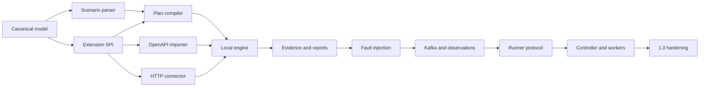

# Faultora delivery roadmap

Status: proposed  
Planning unit: independently verifiable work package  
Primary delivery strategy: walking skeleton followed by vertical slices

## 1. Outcome

Faultora reaches version 1.0 when a team can run it inside its own environment,
import an API description, compose reliability scenarios, distribute execution
when needed, inject bounded failures, verify business invariants, and receive
reproducible CI-ready evidence.

The roadmap deliberately delivers a useful local product before adding a
controller, runners, a web interface, or Kubernetes-specific features.

Every milestone must also pass its assigned controls in
[SECURITY.md](SECURITY.md). Closed-contour operation, secret handling, network
policy, and evidence minimization begin in the foundation and first vertical
slice; they are not deferred to final hardening.

The milestones below define *what* is built and in which order. Their
assignment to versions, and the rule that 1.0 freezes the scenario API, live in
the [release plan](RELEASE_PLAN.md).

## 2. Release sequence

| Milestone | User-visible outcome | Primary proof |
|---|---|---|
| M0 — Foundation | Repository builds and architectural contracts are enforced | Clean build and architecture tests |
| M1 — HTTP vertical slice | One OpenAPI operation can be executed and reported from CLI | CLI-to-HTML/JUnit end-to-end test |
| M2 — Reliability runner | Scenarios express concurrency, retries, eventual assertions, and network faults | Deterministic fault scenario suite |
| M3 — Distributed systems | Kafka and database observations verify cross-component invariants | Payment workflow recovery suite |
| M4 — Private runner | Tests run from a controlled runner inside another network | Remote run with policy enforcement |
| M5 — Distributed execution | Controller schedules reproducible shards across workers | Multi-worker recovery and scale tests |
| M6 — 1.0 hardening | Stable scenario API, extension contracts, packaging, and operational docs | Release qualification suite |

In addition to the primary proof above, each milestone has a security gate from
the security milestone matrix.

## 3. Critical path

Work may proceed in parallel only after the upstream contract is merged or a
versioned fixture has been agreed. Implementations must not invent private
copies of shared models to bypass a missing dependency.

## 4. Workstream ownership

The initial program can sustain four parallel implementation workstreams plus a
cross-cutting security architecture workstream:

| Workstream | Owns | Does not own |
|---|---|---|
| Core model and engine | canonical model, scenario compiler, DAG, lifecycle | protocol implementations |
| Sources and connectors | OpenAPI import, HTTP, later Kafka/gRPC | global run state |
| Evidence and experience | CLI, event journal, reports, diagnostics | execution semantics |
| Test systems and qualification | example services, testkit, integration and E2E suites | production shortcuts |
| Security architecture | threat model, policy invariants, evidence handling, supply-chain gates | feature-specific implementation ownership |

For distributed milestones, add controller/runner and operations workstreams.
Shared build files and public contracts should have a single owner within each
integration wave.

## 5. M0 — Repository and architecture foundation

### Goal

Create a buildable skeleton that makes dependency direction, quality gates, and
public contracts explicit before feature implementation begins.

### Work packages

#### M0-01 — Build skeleton

- Create the Java 21 Maven parent.
- Add the initial modules listed in the architecture document.
- Centralize dependency and plugin versions.
- Enable reproducible builds.
- Configure compiler, unit-test, integration-test, and packaging phases.
- Add dependency-boundary checks.

Acceptance:

- `./mvnw verify` succeeds from a fresh checkout.
- Every module contains a minimal test proving it participates in the build.
- Forbidden module dependencies fail verification.

#### M0-02 — Canonical model v1alpha1

- Define stable typed identifiers.
- Define targets, operations, schemas, authentication schemes, workflows, and
  safety classifications.
- Define normalized errors without connector-specific exception types.
- Provide JSON serialization fixtures.
- Publish compatibility rules for additive model evolution.

Acceptance:

- Golden-file round-trip tests cover the catalog model.
- Equality and serialization are deterministic.
- The model module has no framework or connector dependency.

#### M0-03 — Extension SPI v1alpha1

- Define importer, connector, assertion, fault, secret resolver, and renderer
  contracts.
- Define capability discovery and version negotiation.
- Define lifecycle, deadline, cancellation, evidence, and cleanup expectations.
- Create a technology compatibility testkit for extension implementations.

Acceptance:

- Stub implementations pass the SPI testkit.
- Engine-facing interfaces contain no OpenAPI or HTTP client types.

#### M0-04 — ADR baseline

Record decisions for:

- module boundaries;
- YAML and JSON handling;
- expression language;
- extension discovery;
- run event schema.
- security trust boundaries and deployment profiles;
- secret value lifecycle;
- target and evidence policy model.

Acceptance:

- Each decision states context, chosen option, rejected alternatives, and
  consequences.
- Architecture documentation references the accepted ADRs.

#### M0-05 — Security baseline

- Establish the threat model and versioned security requirements.
- Add typed target, resource, evidence, and extension policies to the core
  contracts.
- Define opaque secret handles and redaction metadata.
- Define security-relevant run and audit events.
- Define offline build and test expectations.
- Add automated dependency, static-analysis, and secret-scanning gates to CI.

Acceptance:

- Security requirements have stable IDs and automated-test mappings.
- A hostile scenario cannot expand its policy through configuration merging.
- Secret-bearing test fixtures prove that serialization and diagnostics remain
  sanitized.
- The build succeeds with network access unavailable after dependencies are
  provisioned.

### Exit gate

- Build, formatting, tests, and dependency checks run in CI.
- Public v1alpha1 model and SPI fixtures are frozen for M1 implementation.
- Threat model, offline deployment profile, and security contracts are approved.

## 6. M1 — First HTTP vertical slice

### User story

A developer points Faultora at an OpenAPI document, binds one test URL, runs a
generated scenario, and receives console, JSON, HTML, and JUnit results.

### Work packages

#### M1-01 — Scenario document v1alpha1

- Define scenario metadata, inputs, setup, execute, assertions, and cleanup.
- Define source locations and environment overlays.
- Implement syntax parsing with source-positioned diagnostics.
- Implement structural validation and schema publication.
- Reject unknown node kinds and unsupported API major versions.

Acceptance:

- Valid and invalid fixture suites cover all fields.
- Errors identify file, path, expected value, and actual value.
- The published JSON Schema matches parser behavior.

#### M1-02 — Expression and binding model

- Resolve input, environment, prior-step output, and run metadata expressions.
- Keep expressions read-only and side-effect free.
- Define missing, null, collection, and type-conversion behavior.
- Redact values originating from secret resolvers.

Acceptance:

- Expression evaluation is deterministic.
- Unsupported functions fail during compilation where possible.
- Diagnostic output never renders secret-derived values.

#### M1-03 — OpenAPI importer

- Support OpenAPI 3.0 and 3.1 documents for the first release.
- Resolve local and explicitly allowed external references.
- Import servers, operations, parameters, request bodies, responses, examples,
  and security schemes.
- Normalize operation IDs and report collisions.
- Propose operation safety classification without silently authorizing it.
- Cache the normalized catalog by content digest.
- Disable remote references by default and enforce reference depth, size,
  destination, and workspace policies.

Acceptance:

- A conformance fixture set covers references, composed schemas, parameters,
  security schemes, and multiple response types.
- Malformed or unsupported documents return actionable diagnostics.
- Import output is stable across repeated runs.
- Hostile and oversized specification fixtures fail within bounded resources.

#### M1-04 — Plan compiler

- Resolve scenario references against the canonical catalog.
- Validate variables and output bindings.
- Validate connector and assertion capabilities.
- Apply execution policy and safety classification.
- Produce an immutable DAG with stable node IDs.

Acceptance:

- Invalid plans never begin target execution.
- Plan snapshots are stable and reviewable.
- Cycle detection and missing dependency tests are present.

#### M1-05 — HTTP connector

- Execute operations from canonical HTTP metadata.
- Support path, query, header, cookie, and body inputs.
- Support JSON and empty bodies initially.
- Enforce connect, request, and total deadlines.
- Normalize DNS, TLS, connection, timeout, cancellation, and protocol errors.
- Record bounded request and response evidence.
- Enforce destination policy before connection and after redirects.
- Use approved trust stores without exposing an insecure scenario-level bypass.

Acceptance:

- SPI connector compatibility tests pass.
- Integration tests cover success, redirect policy, timeout, connection reset,
  invalid JSON, and large response limits.
- SSRF, redirect escape, DNS rebinding, proxy, and TLS-policy tests pass.

#### M1-06 — Core assertions

- Status and documented-status assertions.
- Header assertions.
- Response-schema assertions.
- JSONPath equality, existence, count, and uniqueness assertions.
- Duration assertion using monotonic timing.

Acceptance:

- Every assertion has pass, fail, and indeterminate fixtures.
- Failure messages show expected and sanitized observed values.

#### M1-07 — Local engine

- Execute setup, operation, assertion, and cleanup nodes.
- Maintain the append-only run journal.
- Handle failure, cancellation, deadlines, and cleanup continuation.
- Emit normalized lifecycle events.

Acceptance:

- A forced failure still runs registered cleanup.
- Process interruption recovery behavior is documented and tested where
  technically possible.
- Identical seeded runs produce equivalent plans and generated inputs.

#### M1-08 — CLI and reports

- `faultora init --from-openapi`.
- `faultora validate`.
- `faultora discover`.
- `faultora test`.
- Console progress and summary.
- JSON, JUnit XML, and self-contained HTML renderers.
- Offline mode with no external asset, telemetry, update, or schema requests.
- Evidence-policy summary before execution and in the final report.

Acceptance:

- Exit codes distinguish pass, test failure, invalid configuration, and runner
  failure.
- JUnit output is accepted by a representative CI parser.
- HTML reports work without a server or external assets.
- Default reports contain no captured bodies or authentication headers.

#### M1-09 — Example target and end-to-end proof

- Add a deterministic example payment API.
- Publish its OpenAPI document.
- Add one passing and one deliberately failing scenario.
- Run packaged CLI against the real example service in integration tests.

Acceptance:

- A fresh checkout can build, start the example, execute scenarios, and produce
  all report formats with documented commands.

### Exit gate

- The complete onboarding path works without editing Java code.
- The same scenario succeeds locally and in CI.
- Documentation contains a ten-minute quickstart using the packaged artifact.
- The vertical slice passes with all non-target network egress blocked.

## 7. M2 — Reliability scenario engine

### User story

A developer describes concurrency and recovery expectations, injects bounded
network failures, and can replay the exact failed scenario.

### Work packages

#### M2-01 — Control-flow nodes

- Sequential groups.
- Bounded parallel groups.
- Fixed and data-driven repeats.
- Eventually/poll-until blocks.
- Retry policies with exponential backoff and deterministic jitter.
- Per-node and scenario deadlines.

Acceptance:

- Scheduling tests cover fairness, cancellation, retry exhaustion, and nested
  deadlines.
- Concurrency never exceeds effective policy.

#### M2-02 — Request generation

- Generate values from supported JSON Schema constraints.
- Prefer explicit examples when configured.
- Support deterministic boundary-value and invalid-input strategies.
- Record generated input seeds and shrinkable failure cases.

Acceptance:

- Generated valid payloads pass their source schema.
- Replaying a recorded seed recreates the same payload.

#### M2-03 — Network fault provider

- Integrate Toxiproxy rather than implementing a new TCP proxy.
- Support latency, jitter, timeout, reset, bandwidth, and connection close.
- Model upstream and downstream direction explicitly.
- Register rollback before fault activation is reported successful.
- Enforce hard expiry independently of scenario cleanup.
- Add a local emergency stop that prioritizes rollback and blocks new work.

Acceptance:

- Each fault has an integration test showing activation, observable effect, and
  rollback.
- An interrupted scenario leaves the test dependency reachable after expiry.
- Controller or runner loss cannot extend a fault beyond its hard expiry.

#### M2-04 — Fault-aware evidence

- Add a timeline correlating operations, active faults, retries, and assertions.
- Attribute failures to active fault windows without claiming causation.
- Render concurrency groups and retry attempts in HTML.

Acceptance:

- A reviewer can identify the exact request attempts executed while a fault was
  active.

#### M2-05 — Reliability example suite

- Duplicate idempotency-key requests.
- Provider response timeout after request forwarding.
- Target restart during an operation.
- Slow dependency and retry storm prevention.
- Cleanup after partial setup.

Acceptance:

- The suite detects a known broken implementation and passes after the defect is
  corrected.

### Exit gate

- M2 scenarios are deterministic and replayable.
- Fault cleanup is proven through integration tests.
- Resource and concurrency policies are enforced in the local runner.

## 8. M3 — Event-driven and cross-component verification

### User story

A developer verifies an HTTP-to-Kafka-to-database workflow and asserts that
business invariants survive message redelivery and partial failure.

### Work packages

#### M3-01 — AsyncAPI importer

- Import applications, servers, channels, operations, messages, schemas,
  correlation IDs, and Kafka bindings.
- Translate supported schemas into the canonical catalog.
- Report unsupported protocol bindings without discarding the rest of the
  catalog.

#### M3-02 — Kafka connector

- Publish commands and events.
- Consume with bounded start/end positions.
- Isolate test consumers through generated group IDs.
- Capture keys, headers, partitions, offsets, and sanitized payload evidence.
- Support duplicate publish, delay, and controlled redelivery scenarios.

#### M3-03 — JDBC observation connector

- Execute parameterized read-only observations.
- Apply statement and connection deadlines.
- Bound row and data volume.
- Return a protocol-neutral tabular evidence model.
- Refuse mutating statements using both connector policy and database-level
  read-only credentials/configuration.
- Apply column, row, cell-size, classification, and redaction policies before
  evidence persistence.

#### M3-04 — Cross-component assertions

- Event eventually appears.
- Event count and uniqueness.
- Correlation ID continuity.
- Ordered and unordered event sequence assertions.
- Tabular equality, row count, numeric balance, and uniqueness assertions.
- Compound invariants across HTTP, event, and database evidence.

#### M3-05 — Payment recovery reference system

- Transactional outbox.
- Idempotent consumer.
- Double-entry ledger.
- Provider simulator with accepted-but-response-lost behavior.
- Reconciliation worker.
- Known failure variants selected by configuration.

Acceptance for M3:

- A scenario proves that duplicate delivery creates one business effect.
- A scenario proves that ledger entries balance.
- A scenario detects a lost outbox event.
- A reconciliation scenario resolves an unknown provider outcome.
- All dependencies run as disposable test infrastructure.

### Exit gate

- Faultora verifies at least one complete distributed business invariant.
- Async operations have deterministic observation windows and cleanup.

## 9. M4 — Private-network runner

### User story

A team runs Faultora inside its own network while controlling runs from a CLI or
controller without exposing target services publicly.

### Work packages

#### M4-01 — Runner protocol

- Versioned registration and capability advertisement.
- Outbound mutually authenticated connection.
- Plan dispatch, progress events, cancellation, and artifact upload.
- Heartbeat and lease semantics.
- Compatibility negotiation and graceful rejection.
- Mutually authenticated service identity, certificate rotation, replay
  protection, and signed effective policy.

#### M4-02 — Runner policy enforcement

- Network and target allowlists.
- Operation and fault capability allowlists.
- Concurrency, duration, and evidence limits.
- Signed effective execution policy.
- Local refusal independent of controller behavior.

#### M4-03 — Runner packaging

- Container image.
- Docker Compose example.
- Kubernetes Deployment example without infrastructure fault permissions.
- Health, readiness, diagnostics, and controlled shutdown.
- Deny-by-default ingress/egress examples and an offline installation bundle.

#### M4-04 — Remote-run qualification

- Run the M2 and M3 suites through a runner.
- Interrupt controller connectivity during execution.
- Verify bounded autonomous behavior, reconnection, result delivery, and
  cleanup.

### Exit gate

- No inbound connection to the private network is required.
- Disconnection cannot extend a run or active fault beyond policy limits.
- Local and runner modes produce the same normalized result model.
- Runner deployment passes network-isolation and credential-rotation tests.

## 10. M5 — Distributed controller and workers

### User story

A team submits a large scenario, Faultora partitions it across workers near the
target, and the controller returns one reproducible result.

### Work packages

#### M5-01 — Controller API and metadata

- Projects, environments, policies, catalogs, scenarios, runs, tasks, and
  artifact indexes.
- Optimistic state transitions.
- Idempotent run submission.
- Cancellation and retention lifecycle.
- Organization-controlled identity integration, policy-based authorization,
  security audit events, and separate raw-evidence permissions.

#### M5-02 — Scheduler and task leases

- Compile plans into local and shardable tasks.
- Match workers by capability and locality.
- Claim, renew, expire, retry, and terminate leases.
- Prevent duplicate result commit while tolerating duplicate execution.

#### M5-03 — Distributed worker

- Execute plan shards using the same engine as local mode.
- Derive deterministic shard seeds.
- Buffer evidence and apply backpressure.
- Upload artifacts before committing terminal state.
- Recover unfinished cleanup obligations.
- Enforce policy locally even when controller state is stale or unavailable.

#### M5-04 — Result aggregation

- Merge shard event streams deterministically.
- Aggregate counts, latency distributions, assertion outcomes, and errors.
- Preserve per-shard evidence links.
- Distinguish system-under-test failures from infrastructure and runner failures.

#### M5-05 — Admission and quotas

- Per-project concurrency and request ceilings.
- Maximum run duration and evidence volume.
- Worker capacity accounting.
- Fair scheduling and backpressure.
- Per-environment operation, target, fault, extension, and evidence policy.

#### M5-06 — Distributed qualification

- Worker loss during execution.
- Controller restart.
- Duplicate task delivery.
- Artifact-store interruption.
- Runner disconnect.
- Cancellation while faults are active.

### Exit gate

- Increasing workers increases executable shard capacity without increasing
  controller traffic generation.
- No single worker failure loses the final run record or cleanup obligations.
- Aggregated results remain reproducible from stored manifests and event logs.

## 11. M6 — 1.0 hardening and productization

### Work packages

#### M6-01 — Stable scenario API

- Resolve v1alpha1 feedback.
- Publish migration tooling and compatibility matrix.
- Freeze `faultora.dev/v1` semantics.
- Add deprecation diagnostics for future evolution.

#### M6-02 — Extension isolation

- Define the out-of-process plugin protocol.
- Add plugin manifest, capability, and compatibility validation.
- Provide an SDK and reference extension.
- Add process/container isolation and resource limits.

#### M6-03 — Packaging and supply chain

- Versioned CLI archives.
- Multi-architecture container images.
- Signed artifacts, checksums, CycloneDX SBOM, and SLSA-compatible build
  provenance.
- Verifiable offline bundle with no runtime downloads.
- Helm chart for controller, workers, and runners.
- Upgrade and rollback documentation.

#### M6-04 — Operational readiness

- OpenTelemetry traces, metrics, and structured logs.
- Health and readiness contracts.
- Backup, retention, capacity, and disaster-recovery guides.
- Diagnostic bundle generation.
- Performance and soak-test baselines.

#### M6-05 — Security qualification

- Final threat-model and security-requirement review.
- Network boundary tests.
- Extension isolation tests.
- Policy bypass tests.
- Artifact and report sanitization tests.
- Dependency and container scanning in CI.
- Offline qualification with egress unavailable.
- Independent review of the sensitive-environment deployment profile.

#### M6-06 — User experience

- Guided initialization.
- Scenario examples by failure class.
- Actionable diagnostics with remediation hints.
- Searchable HTML timeline.
- CI examples for common platforms.
- Complete self-hosting and plugin authoring documentation.

### 1.0 exit gate

- A new team completes the documented onboarding flow without source changes.
- Scenario API and result schema compatibility are tested.
- Local, CI, runner, and distributed modes pass the shared qualification suite.
- Cleanup, cancellation, replay, and upgrade paths are verified.
- The release has no unresolved critical security or data-integrity findings.
- Release signatures, SBOM, provenance, and offline installation are verified
  from a clean environment.

## 12. First implementation wave

The first implementation team should execute this exact sequence.

### Wave A — Contracts

Can run in parallel after M0-01 establishes module directories:

1. Canonical model and golden fixtures.
2. Extension SPI and compatibility testkit.
3. Scenario document examples and schema proposal.
4. Run event/result schema and example reports.

Integration gate:

- Compile all contracts together.
- Resolve naming and ownership conflicts.
- Freeze v1alpha1 fixtures before implementation work branches from them.

### Wave B — Independent implementations

Can run in parallel against frozen fixtures:

1. Scenario parser and validator.
2. OpenAPI importer.
3. HTTP connector.
4. Report renderers and CLI command skeleton.

Integration gate:

- Every implementation passes its module tests and shared SPI fixtures.
- No implementation leaks third-party library types into public core contracts.

### Wave C — Vertical integration

Execute mostly in dependency order:

1. Plan compiler.
2. Local engine.
3. Composition root in CLI.
4. Example payment API.
5. CLI-to-report end-to-end scenario.

Integration gate:

- `faultora test` executes a real imported operation and renders all report
  formats.

### Wave D — Hardening

Can run in parallel once the vertical slice passes:

1. Diagnostics and invalid-input corpus.
2. Cancellation and cleanup tests.
3. Packaging and container execution.
4. Documentation and CI examples.

## 13. Work-package contract

Every assigned work package should state:

- objective and user-visible outcome;
- owned modules and files;
- upstream contracts and fixture versions;
- behavior that must not change;
- expected tests;
- exact verification command;
- artifacts or documentation to update;
- known follow-up work explicitly left out.

An implementer should stop and request an architecture decision when:

- a public contract must change;
- module dependency direction would be violated;
- scenario semantics are ambiguous;
- a safety policy would be weakened;
- an extension requires engine-specific behavior;
- implementation depends on an undecided ADR.

## 14. Integration discipline

- Merge contracts before implementations that consume them.
- Keep commits limited to one work package or one necessary integration step.
- Rebase work on the latest accepted contract fixtures before integration.
- Prefer additive changes during an integration wave.
- Do not combine broad formatting changes with functional work.
- Preserve a runnable vertical slice after M1.
- Fix or revert a broken mainline before beginning the next integration wave.
- Run targeted tests while developing and the complete verification suite before
  integration.

## 15. Definition of done

A work package is complete only when:

1. behavior and boundaries match the accepted architecture;
2. primary and material edge cases have automated tests;
3. failure and cleanup behavior are verified;
4. diagnostics are actionable and sanitized;
5. public contracts and configuration examples are documented;
6. relevant architecture decisions are recorded;
7. targeted verification passes;
8. the full build passes when shared contracts or composition change;
9. no unrelated files or behavior are modified.

## 16. Backlog after 1.0

These ideas should not enter the critical path before the 1.0 gates:

- visual scenario builder that emits the same versioned YAML;
- hosted control plane;
- GraphQL and WebSocket connectors;
- gRPC reflection discovery;
- additional brokers;
- Kubernetes infrastructure-fault providers;
- trace topology assertions;
- reusable scenario registry;
- organization policy packs;
- historical reliability trends;
- IDE integration;
- property-based shrinking across distributed runs.
