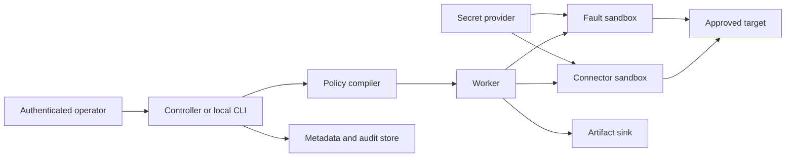

# Faultora security architecture

Status: mandatory architectural baseline  
Audience: security reviewers, platform operators, maintainers, and implementers

## 1. Security objective

Faultora intentionally receives credentials, invokes privileged test APIs,
generates traffic, injects failures, and may observe sensitive responses. Its
default deployment must therefore be suitable for a closed financial-services
environment where source descriptions, traffic, results, and operational
metadata cannot leave the customer's controlled boundary.

The security objective is:

> A compromised scenario, extension, worker, or target must not obtain broader
> network, identity, data, or infrastructure authority than the explicit policy
> granted to that run.

Faultora provides technical controls that support an organization's security
and compliance program. Deployment of Faultora does not by itself establish
compliance with any law, regulation, or internal standard.

## 2. Normative design references

The security program should map verifiable requirements to stable external
baselines rather than rely only on an internal checklist:

- [NIST SP 800-218 Secure Software Development Framework](https://csrc.nist.gov/pubs/sp/800/218/final)
  for development, protection, verification, and vulnerability-response
  practices;
- [OWASP ASVS 5.0](https://owasp.org/www-project-application-security-verification-standard/)
  for application security verification requirements;
- [SLSA 1.2](https://slsa.dev/spec/v1.2/) for build integrity and provenance;
- [CycloneDX](https://cyclonedx.org/specification/overview/) for machine-readable
  software bills of materials.

Mappings are evidence aids, not certification claims. Requirement references
must include the external specification version.

## 3. Deployment profiles

### 3.1 Offline standalone

```text
Closed workstation or CI runner
├── Faultora CLI
├── local specifications and scenarios
├── approved extension bundle
├── local target allowlist
└── local encrypted artifact directory
```

Properties:

- no controller or external service;
- no DNS or network dependency except approved target destinations;
- no update checks, usage telemetry, remote schemas, fonts, scripts, or report
  assets;
- all dependencies and extensions installed from an approved offline bundle;
- self-contained HTML and machine-readable reports;
- deterministic operation without a license server.

This is the first supported profile and the security reference behavior.

### 3.2 Self-hosted connected

All Faultora services run in infrastructure controlled by one organization.
The deployment may access internal identity, artifact, secret, and target
services. External egress remains deny-by-default and is enabled only through
operator policy.

### 3.3 Distributed closed environment

Controller, workers, agents, queue, metadata storage, artifact storage, and
identity provider remain inside approved network zones. Workers are scheduled
according to target locality and cannot receive tasks requiring capabilities or
network destinations outside their policy.

No profile requires a Faultora-operated cloud service.

## 4. Protected assets

| Asset | Examples | Required protection |
|---|---|---|
| Authentication material | API tokens, client certificates, database credentials | never persisted in run events or reports; least lifetime and scope |
| Interface descriptions | OpenAPI, AsyncAPI, Protobuf | local processing, access control, content digest |
| Test inputs | customer IDs, payment references, generated payloads | classification, bounded retention, redaction |
| Target evidence | response bodies, events, database observations | minimization, encryption, audit, retention policy |
| Execution authority | allowed hosts, operations, faults, concurrency | signed or locally trusted effective policy |
| Extensions | connector and assertion implementations | allowlist, integrity verification, isolation |
| Release artifacts | CLI, images, charts, offline bundles | signatures, checksums, SBOM, provenance |
| Audit events | identity, policy decision, run lifecycle, export | append-only storage and controlled access |

## 5. Threat actors and abuse cases

The threat model assumes:

- a malicious or accidentally unsafe scenario;
- a compromised target that returns hostile content;
- a malicious API description containing external references or oversized
  schemas;
- a vulnerable or malicious extension;
- a user attempting to exceed approved targets or load limits;
- a worker or agent operating with stale policy;
- an attacker reading or modifying stored evidence;
- a compromised dependency or release artifact;
- accidental disclosure through logs, reports, exceptions, or diagnostic
  bundles;
- a lost controller connection while a destructive fault is active.

Security review must also consider denial of service against Faultora itself and
against the target system.

## 6. Trust boundaries



Crossing a boundary requires authenticated identity, capability validation,
bounded input, destination policy, and auditable outcome. Controller approval
does not replace worker-side enforcement.

## 7. Security invariants

The following properties are mandatory and testable.

### SEC-01 — No mandatory external communication

Faultora performs no analytics, crash reporting, update checking, schema
download, asset loading, or license validation unless the operator explicitly
configures an allowed destination. Offline mode remains fully functional.

### SEC-02 — Explicit destination policy

Every network connection must map to:

- a declared target;
- an approved infrastructure dependency; or
- an operator-approved source reference.

Redirects, DNS resolution results, proxy destinations, and external `$ref`
documents are validated against the effective policy. Redirects cannot escape
the approved destination set.

### SEC-03 — Secret non-observability

Secret values are represented by opaque handles. They cannot be:

- serialized into the plan or run manifest;
- emitted through `toString`, exceptions, logs, metrics, traces, reports, or
  diagnostic bundles;
- exposed to extensions that do not declare a need for the associated secret;
- retained longer than the operation or prepared-target lifecycle requires.

Redaction is defense in depth; the primary control is preventing sensitive
values from entering observability data.

### SEC-04 — Bounded execution authority

The worker independently enforces:

- target allowlists;
- operation safety classification;
- request count, concurrency, rate, duration, and payload limits;
- fault type, scope, and lifetime;
- evidence volume and retention limits;
- extension allowlists.

Policy failure is terminal and cannot be downgraded by a scenario.

### SEC-05 — Guaranteed fault expiry

Each activated fault has a locally enforceable hard expiry and rollback record.
Loss of controller connectivity cannot extend it. Rollback continues after
scenario failure or cancellation and produces an explicit terminal status.

### SEC-06 — Minimal evidence by default

Default capture includes timing, status, size, hashes, normalized errors, and
assertion-relevant derived values. Full request/response bodies, message
payloads, database rows, and headers require explicit evidence policy.

Capture policy supports:

- field-name and JSONPath redaction;
- header denylist with authorization and cookie headers always protected;
- size and row limits;
- binary-content rejection;
- content-type allowlists;
- retention class and expiry;
- disabled body previews in console output.

### SEC-07 — No arbitrary code in scenarios

The scenario expression language is deterministic, side-effect free, bounded,
and incapable of filesystem, process, environment, class loading, reflection,
or network access. Shell, JavaScript, Groovy, template evaluation, and dynamic
class names are not accepted as scenario features.

### SEC-08 — Extension isolation

Initial built-in extensions are compiled and reviewed with the release. Dynamic
extensions require:

- an allowlisted identity and digest;
- compatible manifest and capability declaration;
- separate process or container isolation;
- resource and network limits;
- explicit secret and target capabilities;
- authenticated versioned RPC;
- no automatic runtime download.

### SEC-09 — Verifiable releases

Each release provides checksums, signatures, a CycloneDX SBOM, build provenance,
and immutable version identifiers for CLI archives, container images, and
offline bundles. Installation documentation includes verification before
execution.

### SEC-10 — Auditability

Security-relevant events record actor/service identity, time, run ID, policy
digest, decision, target identifier, extension identity, fault lifecycle,
artifact export, and administrative changes. Audit events exclude secrets and
captured payload bodies.

### SEC-11 — Fail-closed policy behavior

Missing identity, unsupported policy version, unknown operation classification,
unavailable secret provider, expired lease, failed certificate validation, or
incompatible extension results in refusal rather than fallback.

### SEC-12 — Customer-controlled retention and deletion

Run metadata, evidence, reports, and audit records have separate configured
retention classes. Deletion is explicit, scoped, auditable, and compatible with
legal-hold policy. Local mode provides a documented secure cleanup procedure;
distributed mode exposes controlled lifecycle APIs.

## 8. Identity and access control

### 8.1 Local mode

Local mode relies on operating-system identity and filesystem permissions. It
does not open a listening management port by default.

### 8.2 Controller mode

The controller integrates with an organization-controlled identity provider.
Authorization decisions use project, environment, operation class, fault
capability, evidence class, and action.

Minimum roles:

| Role | Capabilities |
|---|---|
| Viewer | view permitted run summaries and sanitized reports |
| Scenario author | validate and submit scenarios within policy |
| Operator | execute approved scenarios and cancel runs |
| Security reviewer | review policies, extensions, exports, and audit events |
| Administrator | manage deployment configuration and identity bindings |

Roles are templates; authorization is ultimately policy-based. Administrative
identity is not passed through to targets.

### 8.3 Service identity

Controller, worker, agent, plugin host, metadata store, and artifact store use
distinct service identities. Mutual authentication is required across remote
service boundaries, with short-lived credentials and rotation supported by the
hosting organization.

## 9. Network security

- Deny ingress unless required by the selected deployment profile.
- Deny egress by default, then allow explicit target and infrastructure
  destinations.
- Resolve and validate destinations before connecting and after redirects.
- Define behavior for DNS rebinding and address changes during a run.
- Separate management, worker, target, artifact, and audit traffic where the
  platform supports network zoning.
- Disable controller-to-target traffic; only workers or agents invoke targets.
- Do not expose agent management endpoints to the target network.
- Provide Kubernetes NetworkPolicy examples, while documenting that enforcement
  depends on the installed network plugin.
- Support organization-provided trust stores and private certificate
  authorities without disabling certificate validation.

## 10. Data protection

### 10.1 In transit

Remote Faultora service communication is mutually authenticated and encrypted.
Target TLS policy is configurable only within operator-approved bounds;
insecure verification cannot be enabled from a scenario.

### 10.2 At rest

Standalone mode uses an operator-selected protected directory and documents
the requirement for encrypted storage. Distributed mode supports encrypted
metadata and object storage with customer-managed key integration. Application
code never substitutes reversible obfuscation for encryption.

### 10.3 Evidence handling

Evidence moves through explicit stages:

```text
observe -> classify -> minimize -> redact -> bound -> encrypt -> retain/delete
```

If classification or redaction fails, body evidence is discarded and the run
records an evidence-processing error. Test execution may continue only when the
scenario does not require that evidence for its assertion.

### 10.4 Reports

- HTML reports are self-contained and do not load remote resources.
- User-controlled values are escaped for their rendering context.
- Reports use a restrictive content security policy when served through the
  controller.
- Formula-like cells are neutralized in any future CSV export.
- Raw evidence access is authorized separately from summary reports.

## 11. Import and parser security

OpenAPI, AsyncAPI, Arazzo, Protobuf, scenario YAML, and extension manifests are
untrusted inputs.

Parsers enforce:

- maximum document, nesting, string, collection, and resolved-reference sizes;
- reference count and traversal depth;
- cycle detection;
- disabled unsafe YAML type construction;
- explicit policy for local and remote references;
- path normalization and workspace confinement;
- bounded regular expressions and expression evaluation;
- time and memory budgets;
- actionable errors without embedding full hostile input.

Remote references are disabled in the offline profile and opt-in elsewhere.

## 12. Fault and infrastructure safety

- A scenario cannot grant itself process, container, Kubernetes, or database
  privileges.
- Infrastructure fault providers run under separate service identities.
- Kubernetes permissions are namespace- and resource-scoped.
- Fault targets are selected by stable identity and validated immediately before
  activation.
- Each fault records preconditions and a rollback plan before activation.
- Concurrent faults that could invalidate each other's rollback are rejected or
  serialized.
- A global operator kill switch stops admission, cancels work, and prioritizes
  rollback.
- Production-labelled environments reject faults unless an independently
  managed policy explicitly permits the exact capability and scope.

## 13. Plugin security model

Plugins are a high-risk boundary because they may parse untrusted input, access
targets, and receive evidence.

Plugin manifests declare:

- plugin and protocol version;
- content digest and signing identity;
- required network destinations;
- required secret handles;
- filesystem and temporary-storage needs;
- maximum resources;
- supported operations and fault types;
- evidence types produced;
- compatibility range.

The plugin host grants only declared and operator-approved capabilities. Plugin
crash, timeout, malformed output, or protocol violation terminates the affected
node and cannot corrupt global run state.

## 14. Supply-chain security

Development and release controls include:

- protected and reviewable build definitions;
- pinned dependency and build-plugin versions;
- dependency policy and vulnerability review;
- reproducible build settings where supported;
- isolated release build environment;
- generated CycloneDX SBOM;
- SLSA-compatible build provenance;
- signed archives, images, manifests, and offline bundles;
- documented verification commands;
- a vulnerability disclosure and supported-version policy;
- no runtime dependency installation by the runner.

Offline bundles contain the runner, approved built-in extensions, schemas,
licenses, SBOM, provenance, signatures, checksums, and verification tooling.

## 15. Logging, telemetry, and diagnostics

- Usage telemetry is absent by default.
- Operational telemetry exports only to configured internal endpoints.
- Logs use structured event types and an allowlist of fields.
- Request bodies, response bodies, headers, SQL values, message payloads,
  environment variables, and secret material are excluded from default logs.
- High-cardinality customer identifiers are not metric labels.
- Trace attributes use normalized operation and target identifiers, not full
  URLs with parameters.
- Diagnostic bundles require an explicit action, show their contents before
  export, and pass through the same minimization policy as reports.

## 16. Security verification program

### 16.1 Every change

- unit and integration tests for affected security invariants;
- dependency and build-policy verification;
- static analysis;
- secret scanning;
- parser and output-encoding regression tests where relevant;
- architecture tests for dependency and capability boundaries.

### 16.2 Regular qualification

- parser fuzzing and hostile corpus tests;
- policy bypass tests;
- SSRF and redirect escape tests;
- evidence redaction and report injection tests;
- cancellation and fault-expiry tests;
- plugin protocol robustness tests;
- container and deployment configuration scanning;
- dependency vulnerability triage;
- backup, restore, retention, and deletion exercises.

### 16.3 Release qualification

- threat model review;
- ASVS requirement mapping for exposed services;
- SBOM, provenance, signature, and clean-environment verification;
- offline installation test with network egress unavailable;
- upgrade and rollback test;
- independent security review before declaring 1.0 ready for sensitive
  environments.

## 17. Security milestone matrix

| Control | M0 | M1 | M2 | M3 | M4 | M5 | M6 |
|---|---:|---:|---:|---:|---:|---:|---:|
| Threat model and security invariants | required | maintained | maintained | maintained | maintained | maintained | final review |
| Offline/zero-egress execution | design | required | required | required | required | required | qualified |
| Opaque secret handling | contract | required | required | required | required | required | qualified |
| Evidence minimization/redaction | schema | required | extended | extended | required | required | qualified |
| Target and resource policy | contract | required | extended | extended | enforced by agent | distributed enforcement | qualified |
| Fault hard expiry and rollback | contract | N/A | required | required | required | required | qualified |
| Service identity and mTLS | design | N/A | N/A | N/A | required | required | qualified |
| RBAC and audit | event schema | local audit | local audit | extended | service audit | required | qualified |
| Plugin isolation | contract | built-ins only | built-ins only | built-ins only | design validation | implementation | qualified |
| SBOM/provenance/signatures | design | development artifacts | development artifacts | development artifacts | release artifacts | release artifacts | mandatory release gate |

## 18. Security decision backlog

ADRs are required before implementing:

1. secret value type and memory lifecycle;
2. URL, DNS, redirect, proxy, and remote-reference policy;
3. evidence classification and redaction pipeline;
4. local artifact protection and secure cleanup;
5. identity provider and authorization policy model;
6. mTLS bootstrap and certificate rotation;
7. audit event integrity and export;
8. plugin signing, trust roots, and sandbox mechanism;
9. customer-managed key integration;
10. release signing, SBOM, provenance, and offline bundle verification.

